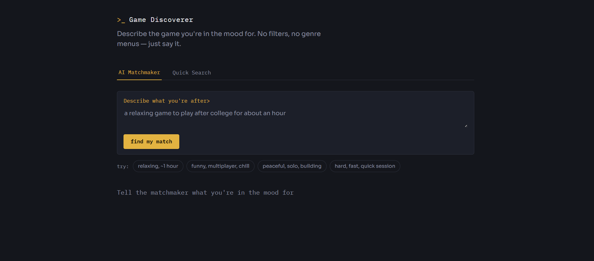
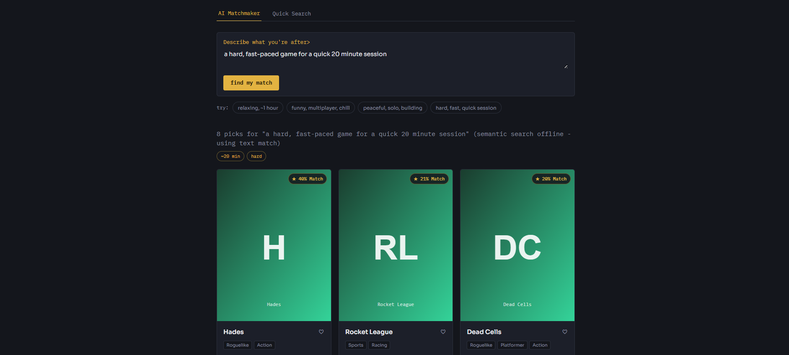
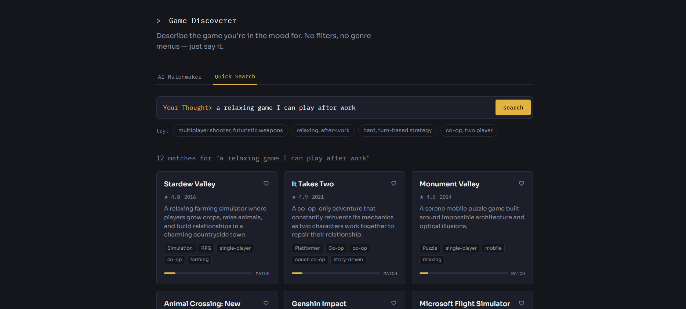

# Playfinder — AI-Powered Game Discovery

# 🎮 Playfinder — AI-Powered Game Discovery

Playfinder is an AI-assisted game recommendation platform built for a **2-member hackathon team**. Instead of searching through hundreds of games manually, users describe the type of game they want in natural language.

Example:

> *"I want a relaxing farming game with multiplayer."*

Playfinder understands the meaning behind the request, ranks the most relevant games, and recommends titles that best match the user's preferences.

---

# 🚀 Features

* 🔍 Natural language game search
* 🤖 AI Game Matchmaker with optional Claude-powered intent extraction
* 🧠 Semantic search using Sentence Transformers
* 🔄 Hybrid recommendation with semantic, genre, tag, and profile signals
* 🖼️ Individual game posters and fallback cover images
* ❤️ Personalized recommendations from liked games
* ⚡ FastAPI backend
* 🌐 Responsive HTML/CSS/JavaScript frontend
* 🛟 Works with fallback logic when external AI services are unavailable

## 📌 Project Snapshot

| Category              | Details                                          |
| --------------------- | ------------------------------------------------ |
| Problem               | Discover games using natural language            |
| Solution              | AI-powered semantic game recommendation platform |
| Team                  | Team Ascenders                                   |
| Backend               | FastAPI                                          |
| Frontend              | HTML, CSS, JavaScript                            |
| Recommendation Engine | Semantic Search + Hybrid Ranking                 |
| AI                    | Claude + Sentence Transformers                   |
| Database              | SQLite                                           |

# Why it's built this way

The brief asks for natural-language game discovery with personalized recommendations. Game
*generation* was explicitly descoped for this submission (see Scope, below), so the effort
goes into making discovery genuinely good rather than half-covering two problems.

Two things made this approach deliberate rather than a thin API wrapper:

1. **The core search understands meaning, not only keywords.** Semantic embeddings are created
   from each game's title, genres, tags, and description. This allows the app to match related
   concepts and user intent instead of depending entirely on exact words in the search query.
2. **An LLM layer enhances the recommendation pipeline.** When an `ANTHROPIC_API_KEY` is set,
   Claude extracts structured intent such as genre, mood, multiplayer preference, and difficulty
   from the raw query. It can improve understanding and explanations, but fallback logic keeps
   the recommendation system functional even when the external AI service is unavailable.

Personalization is a simple, explainable weighting: liking a game nudges its genres and tags
into future rankings for that session. Combined with semantic similarity, this creates a hybrid
ranking system that remains understandable and easy to explain during hackathon judging.

# Architecture

```text
backend/
  app/
    main.py         FastAPI app: routes and application wiring
    recommend.py    Hybrid ranking and profile-based re-ranking
    semantic.py     Sentence Transformer embeddings and semantic search
    nlp.py          Optional Claude layer: intent extraction + explanations
    images.py       Game poster resolution and fallback image handling
    database.py     SQLite-backed session likes -> genre/tag weights
    data/games.json Curated catalog used by the recommendation engine
  static/           Plain HTML/CSS/JS frontend, served by FastAPI directly
```

One process, one port. The frontend is static files (no build step, no framework) served
straight out of FastAPI's `StaticFiles`, so there's nothing to compile before a demo.

# Request flow

1. Frontend posts the raw query + a session id to `POST /api/search`.
2. `nlp.extract_intent` optionally pulls structured hints (genres, tags, mood and search text)
   from the query via Claude. It falls back gracefully when no API key or AI service is available.
3. `semantic.py` converts the query into an embedding and compares it with cached game embeddings.
4. `recommend.py` combines semantic similarity with genre, tag, and profile-based ranking signals.
5. Results return with a `match_score`, recommendation reasons, and a game poster or fallback image.

# Running it

```bash
cd backend

python -m venv .venv

# Windows
.venv\Scripts\activate

# macOS/Linux
source .venv/bin/activate

pip install -r requirements.txt

# Optional: create a .env file and add your Anthropic API key
# ANTHROPIC_API_KEY=your_api_key

python -m uvicorn app.main:app --reload
```

Open **http://localhost:8000** in your browser.

# Deployment

The application is deployed on **Render**.

### Live Demo

https://game-discoverer-1.onrender.com

### Render Configuration

**Runtime**

```text
Python
```

**Root Directory**

```text
backend
```

**Build Command**

```bash
pip install -r requirements.txt
```

**Start Command**

```bash
uvicorn app.main:app --host 0.0.0.0 --port $PORT
```

### Environment Variables

If you want to enable Claude-powered intent extraction and enhanced recommendation explanations, add:

```text
ANTHROPIC_API_KEY=your_api_key_here
```

If no API key is provided, Playfinder automatically falls back to its semantic and hybrid recommendation logic.

# 🧠 How It Works

1. User enters a natural-language description of the game they want.
2. The AI Game Matchmaker analyzes the request and extracts relevant preferences.
3. The query is converted into a semantic embedding using `all-MiniLM-L6-v2`.
4. Semantic similarity compares the query against the cached game catalog embeddings.
5. Genre, tag, and previous likes contribute additional signals to the final ranking.
6. Ranked recommendations return with match scores, explanations, and individual game posters.
7. Fallback logic keeps recommendations available if optional AI services are unavailable.

---

## 📷 Application Preview

### Home Page



### AI Matchmaker



### Personalized Recommendations



# Scope for this submission

* **In scope:** AI Game Matchmaker, semantic search, ranked recommendations, personalization,
  individual game posters, and a working end-to-end UI.
* **Descoped:** generating a playable game from the prompt. The brief calls this out as
  "where feasible" — for a 2-person, 4-day build, a real generator would either be too
  shallow to demo well or consume the time needed to make intelligent game discovery solid.

# Extending it

* **Bigger catalog:** `recommend.py`, `semantic.py`, and `games.json` can support a larger
  curated catalog, with embeddings regenerated or cached when new games are added.
* **Real user accounts:** `database.py` keys everything off `session_id`; swapping that for an
  authenticated user id is a small change, not a rewrite.
* **Better ranking:** the hybrid pipeline can later include vector databases, collaborative
  filtering, hardware compatibility, live game APIs, or larger semantic embedding models.

# 🛠 Tech Stack

### Frontend

* HTML5
* CSS3
* JavaScript

### Backend

* FastAPI
* Python

### AI / Recommendation

* Sentence Transformers
* all-MiniLM-L6-v2
* Semantic Similarity
* Cosine Similarity
* Hybrid Ranking
* Claude API (optional)

### Database

* SQLite

---

# 📌 API Flow

```text
User
   │
   ▼
Frontend
   │
POST /api/search
   │
   ▼
FastAPI
   │
   ├── Intent Extraction (Claude)
   │
   ├── Semantic Embedding
   │
   ├── Hybrid Recommendation
   │
   ├── Profile Re-ranking
   │
   ▼
Results + Game Posters
```

---

# 👥 Team

This project was developed by **Team Ascenders**.

### Musudi Shubhankar Rao

* Backend Development
* AI Integration
* Semantic Recommendation Engine
* Database

### Devansh Chaudhary

* Frontend Development
* UI/UX Design
* API Integration
* Testing & Presentation

---

# 📄 License

This project was created for educational and hackathon purposes.
